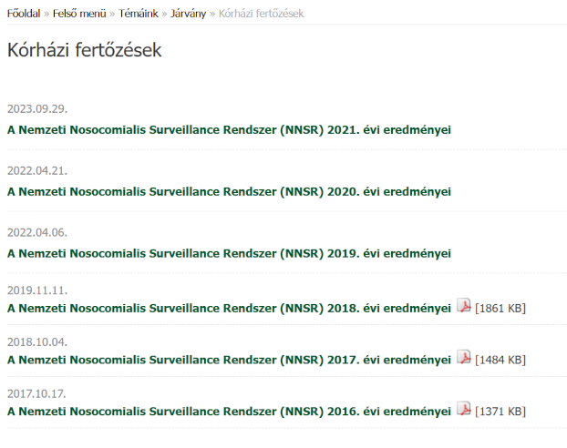

```{r setup, include=FALSE}
knitr::opts_chunk$set(echo = TRUE, fig.width = 12, dpi = 300)
```

## Összefoglaló gondolatok

- A bíróság döntése nyomán elérhetővé vált a kórházi fertőzésekre vonatkozó magyar adatgyűjtés 2015 és 2016. évi adatbázisa, melyben soha korábban nem látott részletezettségű, egyedi adatok vannak: a betegről ugyan kevés információ van (még a neme és életkora sem szerepel, hogy ne legyen beazonosítható), viszont a fertőzés ténye, a kórház és a kórházi osztály meg van adva, több egyéb információ mellett.
- Ez lehetővé teszi az egyes kórházak összehasonlítását, ami nagyon fontos feladat, mind a közvélemény, mind az egészségügyi ellátórendszer és annak irányításáért felelős szervek számára -- azonban _óvatosnak kell lenni_.
- Az egyik probléma, hogy nem biztos, hogy a jelentési fegyelem ugyanolyan minden kórházban: lehet, hogy ahol több kórházi ellátással összefüggő fertőzés fordult elő, ott nem baj van, hanem ellenkezőleg, több ilyen irányú vizsgálatot végeznek és lelkiismeretesebben jelentik a feltárt eseteket. Ez jelen esetben különösen kritikus problémakör, nehogy a rangsor épp ezeket a kórházakat büntesse, előnytelen színben tüntetve fel őket. Sajnos azonban -- információ híján -- erre korrigálni nem lehet (egyedül annyi mondható, hogy a hivatalos szervek nem hivatkozhatnak erre, hiszen az ő közleményeikben soha fel nem merült, hogy a magyar jelentési rendszer működésében bármiféle tökéletlenség lenne).
- A másik probléma, hogy az egyes kórházak eltérnek az általuk ellátott betegek összetételében is (állapot súlyossága, társbetegségek, nem, életkor stb.), így egyáltalán nem biztos, hogy ahol több a fertőzés, ott valami baj van -- az is lehet, hogy ott egyszerűen rosszabb állapotú, és így kórházi fertőzésre is hajlamosabb betegeket látnak el. Bár paradoxnak hangzik, de akár még az is előfordulhat, hogy ott jobb a helyzet, ahol több fertőzés fordul elő, ha a betegösszetétel annyival előnytelenebb.
- Ez utóbbi probléma esetében azonban, ha nem is tökéletes megoldásra, de korrekcióra van lehetőség; jelen elemzés ezt a kérdést fogja körbejárni. A vizsgálat alapvetően két ötletre épít. Az egyik, hogy nem kórház-szintű fertőzés gyakoriságot használ, hanem osztály szintjén számolja az előfordulást. Ez azért fontos, mert az egyes szakmák érzékenysége a kórházi fertőzésre nagyon eltér: egy intenzív ellátás sokkal nagyobb kockázatot hordoz ilyen szempontból, mint mondjuk egy szemészet (a végzett beavatkozások és a betegek állapota miatt is). Ez automatikusan előnytelenebb helyzetbe hozza azokat a kórházakat, ahol van intenzív ellátás, vagy ahol nagyobb intenzív osztály van. Ha tehát nem kórházat hasonlítunk kórházzal, hanem osztály szinten dolgozunk, az jóval homogénebb összehasonlítás lesz. Azonban még intenzív osztály és intenzív osztály (vagy épp szemészet és szemészet) között is nagy különbség lehet, úgyhogy fontos lenne még pontosabban korrigálni a betegösszetételre. Erre sajnos direkt lehetőség nincsen -- az adatbázisban még életkor és nem sincs, társbetegségek ugyan vannak, de a korrekcióhoz ismerni kellene a fertőzést el nem szenvedett kórházi betegek hasonló adatait is, ami viszont nem áll rendelkezésre -- de egy indirekt lehetőség felvethető. Ez pedig az, hogy bár egy adott kórház adott osztályán kezelt betegek orvosi súlyosságáról nincs nyilvánosan elérhető adat, de "pénzügyi súlyosságáról", azaz az utánuk elszámolt költségekről van. Nem feltételezhető, hogy a kétféle súlyosság pontosan ugyanaz, viszont az sem igaz, hogy semmi kapcsolat nincs köztük: a rosszabb állapotú, idősebb, esendőbb -- és így kórházi fertőzésre is fogékonyabb -- betegeknél vélhetően a kezelés is hosszabb, költségesebb, így ez utóbbi súlyosságot felhasználhatjuk, hogy ha nem is tökéletesen, de valamennyire korrigáljunk, így javítva a becslést.
- A vizsgálatra ún. regressziós modellezéssel került sor, mely a biostatisztika legáltalánosabban használt eszköze ilyen helyzetek kezelésére. Miután a megfelelő modellt kiválasztottuk, megtehetjük, hogy a segítségével minden kórházra kiszámolunk egy olyan fertőzés-gyakoriságot, ami -- a fenti limitációk erejéig -- _korrigálva van_ a kórházak eltérő betegösszetételére, ebből fakadóan jobban összehasonlíthatóvá teszi egymással a különböző kórházakat. (Természetesen a jelentési fegyelem problémáján ez sem tud segíteni.)
- A modellezés során több döntést kell hozni, ezek némely esetben nem egyértelműek, ezért fontos, hogy minden ilyen döntési helyzetben az összes szóba jövő lehetőséget megvizsgáljuk. Ezt hívják érzékenységvizsgálatnak, hiszen kiderül belőle, hogy a végeredmény mennyire érzékeny arra, hogy milyen modellt választunk. Szerencsés esetben a különböző modellek eredményei nagyjából egybecsengenek, ami megnyugtató, hiszen ilyenkor mondhatjuk, hogy a válasz nem nagyon függ attól, hogy pontosan milyen modellezési stratégiát választottunk.
- Nagyon fontos kérdés ezen adatok, vizsgálatok kapcsán a _transzparencia_, két okból is. Az egyik a _bizalom_: mint minden népegészségügyi rendszer esetében, itt is igaz, hogy a bizalom megteremtésének és fenntartásának a legjobb eszköze az, ha az adatok, elemzések nem felkent emberek belügyei, hanem minden állampolgár (azaz minden érintett!) számára -- az adatvédelmi, személyiségi jogi szempontok betartásával -- megismerhetőek, az elemzési folyamat és az eredmények nyilvánosak, bárki számára ellenőrizhetőek. Nem igaz, hogy a bizalmat rombolja az, ha rosszak az eredmények (sőt, bizonyos értelemben ez erősíti meg a legjobban, mert azt mutatja a lakosságnak, hogy még ezeket sem kell eltitkolni, tehát lehet hinni az adatoknak), ami rombolja a bizalmat, az az elhallgatás és a titkolózás, az -- adatok híján kialakuló! -- szájhagyományok és rémhírek, az "ehhez te úgysem értesz, ne üsd bele az orrod az okos szakemberek dolgába"-szemlélet. A másik szempont a _hibajavítás_: több szem többet lát, minél többen tekinthetnek bele az adatgyűjtési és adatelemzési folyamatba, annál valószínűbb, hogy kiderülnek a hibák, felmerülnek az esetleges jobb elemzési lehetőségek.
- Sajnos ennek a szempontnak a jelenlegi magyar rendszer igen rosszul felel meg: kevés információt ad meg, azt is gyakran késve, kellő magyarázat nélkül, elégtelen részletezettséggel, a limitációk feltárása nélkül.
- Remélhető, hogy ez a projekt ezzel szemben arra is gyakorlati, valós _példát ad_, hogy milyen előnyei vannak a transzparens hozzáállásnak: noha nagyon nehézkesen megszerzett, nehezen feldolgozható formátumú adatokból, a hivatalos szervek támogatása nélkül készült, már így is, első nekifutásra is olyan mélységű elemzést, és olyan részletezettségű eredményeket produkált, ami soha korábban nem jelent meg Magyarországon. Olyan adatokról beszélünk, amelyek ismerete közvetlenül felhasználható az egészségügyi rendszer javítására!
- A transzparenciát saját magamra is érvényesítem: minden elemzést végző statisztikai kódot teljes terjedelemben, bárki számára nyilvánosan elérhetővé teszek ebben a dolgozatban. Pontosan a fenti két okból: azért, hogy erősítsem a bizalmat abban, hogy a végeredményeim helyesek (hiszen bárki ellenőrizheti azokat, a teljes számítással együtt), és azért, hogy az esetleges hibák, jobb elemzési lehetőségek kiderülhessenek. Ez utóbbi is nagyon fontos: egy ilyen kérdés soha nem "befejezett" téma, ez egy aktív kutatási terület, nem csak, hogy nem probléma, hanem kifejezett öröm számomra, ha valaki kijavítja, továbbfejleszti a munkámat, és még jobb elemzést készít; ezt is próbálom elősegíteni a statisztikai kódok közlésével és a hozzá fűzött magyarázatokkal.
- A transzparenciával szemben gyakran felhozott érv, hogy az emberek "nem értik meg" vagy "félreértik" a számokat. Ezt az érvelést ilyen formában nem tartom elfogadhatónak. Nem azért, mert ne lenne igaz: igen, könnyen lehet, hogy lesz, aki nem érti meg, könnyen lehet, hogy félreértések adódnak, de erre nem az a megoldás, hogy akkor inkább a sötétségben tartunk mindenkit, hanem az, ha segítünk a megértésben! Igen, teljesen egyetértek, "pontos tájékoztatás" és "megfelelő tudás" nélkül félrevezetőek lehetnek az adatok, de erre nem az a megoldás, hogy akkor nem mondunk semmit, hanem az, ha pontos tájékoztatást adunk, megfelelő tudással! Értelmezést adunk az adatokhoz, közérthető magyarázatot nyújtunk, statisztikai korrekciókkal védekezünk a torzítások ellen (ahogy jelen elemzésben is történt). Ebben is igyekszik példát mutatni ez a vizsgálat: a lenti írás kísérletet tesz -- az elemzésen túl -- arra is, hogy az előbbieknek megfelelően egy közérthető magyarázatot adjon az adatok és az eredmények értelmezéséhez.
- Az viszont legitim kérdés, hogy helyes-e a kórházak nevének közlése. A probléma az, hogy ez rossz esetben olyan viselkedést is kiválthat, ami károkat okoz (például nyilván nem engedhető meg, hogy a betegek elkezdjenek tömegesen egyik kórházból a másik áramlani, összeomlasztva az ellátórendszert). A személyes véleményem, hogy a minőségbiztosítást az szolgálja jobban, ha a kórháznevek is nyilvánosak, így a fenti probléma valójában inkább a hosszú és rövid távú szempontok ütközésére példa. Valóban elképzelhető, hogy a transzparens modellre való átállásban lesz egy átmeneti, turbulens, fáradságos időszak, ám ennek révén juthatunk el egy olyan állapotba, mely -- a fent vázolt okokból -- sokkal jobban szolgálja mind a betegek, mind az orvosok és ápolók érdekeit. Éppen ezért véleményem szerint a megoldás nem az, hogy erre a nehezebb időszakra tekintettel elhalogatjuk az áttérést (nyilván a végtelenségig), hanem az, ha ezekre a problémákra tudatosan készülünk, például épp a felvilágosítással, amire próbál ez az írás is példát adni.
- A másik szempont, amiben véleményem szerint példát mutat ez a projekt: az _adatalapú elemzés_ és döntéshozatal szerepének, jelentőségének és erejének felmutatása. Ezt gyakran szokták emlegetni manapság, de sajnos kevés nyilvános példa van arra, hogy miért fontos ez, milyen információkat lehet előállítani megfelelő statisztikai módszerek alkalmazásával, és azok miért relevánsak. Az itteni eredmények nagyon erős példát adnak erre: egy fontos kérdésben segítenek a tisztánlátásban, megmutatva, hogy megfelelő szándék esetén hogyan segítheti az adatokra alapozott elemzés az egészségügyi ellátórendszer jobbítását, a hibák feltárását. Itt fontos rögtön hozzátenni, hogy a "hiba" szót a legáltalánosabban értelemben használom, és egyáltalán nem csak olyanokra gondolok, hogy egy kórházban van valami probléma mondjuk a fertőtlenítéssel: az is hiba, ha gyanúsan nagy különbségek vannak a kórházak között, és ezért felmerül, hogy nem korrigáltunk jól a betegösszetételre, vagy, ha itt sem találunk gondot, akkor talán a jelentési fegyelem kapcsán kell vizsgálódnunk? Akárhogy is, az adatok megmutatják, hogy _valamit_ javítanunk kell, és, ami nem kevésbé fontos, abban is adhatnak iránymutatást, hogy mit.
- Csak zárójelben teszem hozzá, de hátsó szándékom példát mutatni a biostatisztikus gondolkodásmódra is (különös hangsúllyal két szemponton: hogy miért fontos az adatok, adatforrások limitációinak megértése, valamint annak megmutatása, hogy nagyon gyakran nincsenek egyszerű, egymondatos, egy perc alatt elmondható válaszok a kérdésekre).
- Zárásként fontos hangsúlyozni, hogy az egész kérdéskör véleményem szerint elsősorban nem az "ujjal mutogatásról", a személyi felelősök kereséséről kell, hogy szóljon, nem arról, hogy "te elrontottad, mert nem mostál kezet, pedig kellett volna!". Még ha igaz is, ez a megközelítés sokszor pont a lényeget téveszti szem elől: biztos, hogy a hibák _csak és kizárólag_ ilyen _egyéni szinten_ értelmezhetőek és értelmezendőek? Hogy ennek feltárásával a végére jártunk a problémának? Nem lehet, hogy a hibázás egész véletlenül összefüggésben van azzal, hogy hány beteg jut egy ápolóra az adott kórházban vagy osztályon? (Vagy akár az egész egészségügyi ellátórendszerben.) Hogy milyen az adott osztály biztonsági kultúrája, az infekciókontroll protokollok betartásának és betartatásának mértéke, mit látnak az egészségügyi dolgozók a régebb óta ott dolgozó munkatársaiktól, a feletteseiktől, mibe szocializálódtak bele, rendelkezésre áll-e kellő mennyiségű és minőségű fertőtlenítőszer és védőeszköz? Népszerű szóval élve: a _rendszerszintű_ kérdések. Bár természetesen van szerepünk, de a hibák általában nem kizárólag az emberi hanyagság, tudatlanság, figyelmetlenség kontextusában értelmezhetőek: van egy környezet, mely lehet táptalaja is annak, hogy ilyen hibák megtörténjenek, de csökkentheti is ezek valószínűségét. Ennek a megértése kritikusan fontos ahhoz, hogy a kórházi rangsorok mögött meghúzódó okokat jobban lássuk és láttassuk, mert csak ez vezethet el minket ahhoz, hogy a helyzeten javíthassunk és megtaláljuk ehhez a legjobb megoldásokat. Az egyéni felelősségrevonás is lehet elkerülhetetlen, de önmagában ettől érdemi, tartós, önfenntartó javulás nem várható egy egészségügyi rendszerben. Akkor van lehetőségünk a beavatkozási lehetőségek jó megfogalmazására, ha a rendszer egészének is megértjük a viselkedését, azonosítjuk a hibákat megelőző és azokat elősegítő pontjait, mert így tudjuk a leghatékonyabban javítani a rendszer teljesítményét, ezzel szolgálva a betegek és az egész magyar lakosság érdekeit.

## A kutatás előzményei: helyzetkép a magyar adatközlésről

Az egészségügyi ellátással összefüggő fertőzések (angol kifejezéssel és rövidítéssel healthcare-associated infection, HAI, általánosan használt leszűkítéssel "kórházi fertőzések", orvosi szóval nosocomiális fertőzések) nyomonkövetése és átfogó, standardizált elemzése bő 20 éves múltra tekint vissza Magyarországon. 2002-ben, amerikai minta alapján [született meg](https://www.nnk.gov.hu/index.php/jarvanyugyi-es-infekciokontroll-foosztaly/epinfo-kiadvany/category/322-2002?download=2271:honlapnosocomialis-2002) az első teljeskörű, precíz definíciója az ilyen fertőzéseknek, majd 2004. november 1-én [indult el](http://www.oek.hu/oekfile.pl?fid=1071) a szisztematikus adatgyűjtés az ún. Nemzeti Nosocomialis Surveillance Rendszer (NNSR) keretében. 2006-ban vált teljessé az induló éra eljárásrendje a standardizált módszerek teljeskörű leírásának [megjelenésével](https://www.nnk.gov.hu/index.php/jarvanyugyi-es-infekciokontroll-foosztaly/epinfo-kiadvany/category/326-2006?download=2286:honlapsurveillance-2006-4). Ebben az időszakban kötelezően jelentendő volt minden multirezisztens kórokozó (MRK) okozta kórházi fertőzés és minden kórházi véráramfertőzés (VÁF), valamint minden kórházi járvány. 2009-ben [született meg](https://njt.hu/jogszabaly/2009-20-20-0B) a mai napig hatályos, úttörő jellegű rendelet, mely a területet alapvetően szabályozza.

A következő nagy frissítésre 2014-ben került sor: ekkor jelent meg az [új változata](https://www.nnk.gov.hu/index.php/jarvanyugyi-es-infekciokontroll-foosztaly/epinfo-kiadvany/category/334-2014?download=2346:ml-hai-def-2014-honlap) az alkalmazott definícióknak, mely leváltotta (és kibővítette) a korábbi verziót; ugyanebben az évben [jelent meg](https://njt.hu/jogszabaly/2014-1-20-5H) az a rendelet is, ami a korábbi rendeletet kiegészítve szabályozta a jelentési rendet. Ekkor már a korábban felsoroltakon kívül a Clostridium difficile (mai nevén: Clostridiodies difficile, CDI) okozta fertőzéseket is kötelezően jelenteni kellett az előbbieken felül. Szintén kötelezővé vált az alkoholos kézfertőtlenítőszer-felhasználásra vonatkozó jelentés. (A kötelező jelentéseket több választható modul is kiegészíti.)

A mostani szempontunkból különösen fontos aspektus az adatok közlése. Eleinte ez meglehetősen egységes rendben zajlott. A 2005-ös eredmények [2006 februárban](https://www.nnk.gov.hu/index.php/jarvanyugyi-es-infekciokontroll-foosztaly/epinfo-kiadvany/category/307-2006?download=1761:honlapheti-2006-7) (MRK), illetve [áprilisban](https://www.nnk.gov.hu/index.php/jarvanyugyi-es-infekciokontroll-foosztaly/epinfo-kiadvany/category/307-2006?download=1726:honlapheti-2006-13) (VÁF) jelentek meg, a 2006-os eredmények [2007 júniusban](https://www.nnk.gov.hu/index.php/jarvanyugyi-es-infekciokontroll-foosztaly/epinfo-kiadvany/category/309-2007?download=1787:honlapheti-2007-24) (MRK), illetve szintén [júniusban](https://www.nnk.gov.hu/index.php/jarvanyugyi-es-infekciokontroll-foosztaly/epinfo-kiadvany/category/309-2007?download=1786:honlapheti-2007-23-2) (VÁF), a 2007-es eredmények [2008-ban](http://www.oek.hu/oekfile.pl?fid=4208), majd pedig az említett 2009-es rendelet immár hivatalosan is szabályozta, hogy az adott évi jelentést mindig a következő év június 1-ig kell közzétenni (14. § (2) bekezdés). Ez megtörtént [2009-ben](http://www.oek.hu/oekfile.pl?fid=4209), [2010-ben](http://www.oek.hu/oekfile.pl?fid=4214), [2011-ben](http://www.oek.hu/oekfile.pl?fid=4215) és [2012-ben](http://www.oek.hu/oekfile.pl?fid=4501). Ekkor azonban jött a csavar: a 2012-es adatokat nem adták ki 2013. június 1-ig. Erre semmiféle jogi lehetőség nem volt: egész egyszerűen elszabotálták a jogszabályt. Nem néhány napról beszélünk: csak 2015-ben (két _évvel_ később!) jelent meg a teljes terjedelmű jelentés a [2012-es](http://www.oek.hu/oekfile.pl?fid=6092) és [2013-as](http://www.oek.hu/oekfile.pl?fid=6093) eredményekkel. Ezek adattartalma is megérne egy külön misét: ha semmi mást nem nézünk, a 2011-es jelentés még 53 oldal hosszú volt, az illegálisan visszatartott 2012-es -- a két év késéssel történő megjelenés szerinti állapotában -- 17 (!) oldal, de a 2013-as még ezt is alul tudta múlni a maga 13 oldalával... Ekkor úgy döntött az egészségügyi irányítás, hogy legalizálja az általa teremtett jogszabály-ellenes magatartást, és egy [2015-ös rendelettel](https://njt.hu/jogszabaly/2015-54-20-5H.0#CI) egyszerűen lecserélte a határidőt június 1-ről szeptember 1-re. Azonban ez sem segített: a 2015-ről szóló jelentés _megint_ nem jelent meg nem csak június 1-re, de szeptember 1-re sem. Indoklás ismét nem volt, végül októberben [jött ki](http://www.oek.hu/oekfile.pl?fid=7418) a jelentés. A jelek szerint látták, hogy ez így kevés lesz, ezért 2018-ban [újabb módosítás](https://njt.hu/jogszabaly/2018-32-20-5H.0#CI) jött, ekkor november 1-re módosították a határidőt.

A 2016-ot követő évekről jó összefoglalót ad a [hivatalos honlap](https://www.antsz.hu/felso_menu/temaink/jarvany/korhazifert) aktuális kinézete:



Az ábrán nem látszik (mert a honlapra még most sem tették ki a linket...), de a 2022-ről szóló jelentés [határidőre megjelent](https://www.nnk.gov.hu/dokumentumok/NNSR_jelent%C3%A9s_2022._1._r%C3%A9sz_k%C3%B6telez%C5%91_surveillance_modulok.pdf). Az előző évek azonban izgalmasabbak: mint látszik, a 2021-ről szóló jelentés nemhogy a saját határidejére nem jelent meg, de kis híján a _következő évi_ jelentés határidejére sem... A 2019-ről szóló jelentés még ezt is felül tudta múlni: a következő évi jelentés határideje _utáni_ évben jelent meg. Az igazán szomorú azonban nem ez, hanem a konkrét dátum: ránézésre is elég furcsa lehet, hogy szinte egyezik a következő évi jelentés dátumával. Nos, a következő történt: a 2019-es és 2020-as jelentések kiadását _megint_ elszabotálták (bocsánat, de erre nincs jobb szó: mindennemű indoklás nélkül egyszerűen nem tették közzé, a jogszabályi kötelezettség ellenére sem). 2021 novemberében, amikor már nem hogy a 2019-es, de már a 2020-as is meg kellett volna hogy jelenjen, és mindig nem tették közzé egyiket sem, egy szervezet adatigénylést nyújtott be ezekre vonatkozóan. Jellemző adalék a hivatalos szervek rosszhiszeműségére, hogy az erre adandó válasz határidejét előbb 30 nappal meghosszabbították, aztán 45 nappal meghosszabbították (mindkét esetben a rendelkezésre álló határidő legutolsó napján, délután 4 óra körül értesítve a szervezetet a hosszabbításról -- az ilyen beidőzítésnek valószínűleg nagyobb volt a munkaigénye, mint az egy darab fájl csatolásának és elküldésének lett volna...), majd miután a második határidő is lejárt, nemes egyszerűséggel többet nem válaszoltak nekik. Ezen a ponton a szervezet beperelte az NNK-t -- és ezután került fel a két dokumentum, ezért szinte egyszerre.

Összefoglalva megállapítható, hogy 2004 és 2013 között rendben, és a jogszabályoknak megfelelően zajlott a jelentések közzététele, 2013 után azonban ismétlődően, nyílt jogszabály-szegések árán, teljes rosszhiszeműséggel próbálták (és néha évekre sikerült is) eltitkolniuk a -- köz érdekét szolgáló, és közpénzből összeállított -- jelentéseket a közvélemény előtt.

Na de mi a helyzet a jelentések tartalmával? A válaszadást bonyolítja, hogy ez az évek során is alakult, de ha a legutóbbi, 2022-ről szóló jelentést vesszük alapul, akkor a következő dolgokat említeném meg (minden bizonnyal szubjektív válogatásként a részemről):

- Elfogadva azt, hogy az adatok kórház szempontjából aggregáltak, ezen belül impresszív részletezettségűek (a 2022-es jelentésnek csak a kötelező modulról szóló része több mint 60 oldal hosszú), számos fontos, releváns, jól prezentált elemzéssel, melyek kitűnően használhatóak szakmabeliek számára. Sok oldalról megvilágítják az adatokat, informatív, mély lebontásokkal.
- Mindezek közvélemény számára történő érthetősége viszont enyhén szólva kérdéses; minden további magyarázat helyett, kíváncsi volnék, hogy a következő mondatot hányan értik az átlagos újságolvasó állampolgárok közül: "A kórházankénti incidencia percentilisek az alábbi értékek között helyezkedtek el: P25 = 6,7; P50 = 14,4; P75 = 30,8. A kórházankénti incidencia-sűrűség percentilisek az alábbi értékek között helyezkedtek el: P25 = 9,5; P50 = 23,2; P75 = 50,9.". (A jelentés sehol nem definiálja, hogy mit jelent az "incidencia", mivel másabb az "incidencia-sűrűség", mi az, hogy "percentilis", meg "P25".) Fel lehet persze úgy fogni, hogy ez egy szakmának szóló anyag, és akkor minden rendben van, csak akkor meg ez egy kihagyott lehetőség: ehhez képest már igazán kis munkával lehetett volna némi magyarázatot is hozzáfűzni, ami kevés energiabefektetésért cserében drámaian megjavította volna az anyag hozzáférhetőségét, értelmezhetőségét.
- Az előbbi alpontjaként: miközben a részletezettség kitűnő, de ez azt csak még problémásabbá teszi, hogy nincs semmilyen összefoglaló az anyagban. Nincs egy rövid szöveges leírás, egy átfogó táblázat, mindent a megfelelő helyekről kell kinézni (amit megtalálni sem feltétlenül könnyű). Ha csak az egyik legkézenfekvőbb kérdést veszem, hogy "hányan haltak meg 2022-ben Magyarországon kórházi fertőzésben?", arra is csak úgy lehet válaszolni, ha négy különböző helyet talál meg az ember, és veszi ki onnan az adatokat, majd kézzel összeadja.
- Az írás még csak érintőlegesen sem foglalkozik a limitációkkal. Egyetlen szó nincs a jelentési fegyelemről, egy hangot nem mond a tesztelési aktivitás kérdéseiről.

A jelentés kapcsán visszatérő kérdéskör, hogy nem közöl kórházankénti adatokat. Az erről szóló véleményemet már fent, az összefoglalóban is kifejtettem. Itt most csak annyit említenék meg, hogy miközben az az egyik legtipikusabb -- és teljesen jogos -- ellenérv e témában, hogy ezek a számok félrevezetőek a betegösszetételre való korrekció nélkül, valójában a jelentés is közöl, ha nem is kórházra, de régióra lebontott adatokat, amelyek pontosak ugyanúgy félrevezetőek korrekció nélkül (hiszen a betegösszetétel ugyanúgy eltérhet régiónként is) -- mégis, a jelentés minden korrekció nélkül közli ezeket.

## A kutatás eredményeinek magyarázata

### Bevezetés

A különböző kórházak összehasonlítása a kórházi fertőzések előfordulásának gyakorisága szempontjából nem egyszerű feladat, ahol a "nem egyszerűség" egyik jelentős komponense épp az, hogy közben nagyon egyszerűnek tűnhet.

Rendelkezésre áll egy adatbázisunk (nevezzük NNK táblának), melyben minden sor egy bejelentett kórházi fertőzés, számos adatával, többek között a fertőzés kórházával, osztályával, időpontjával. Ebből egyszerű összeszámolással megkapjuk az egyes kórházakban előforduló fertőzések számát, ezután megnézzük, hogy ez melyik kórházban több, melyikben kevesebb, és végeztünk is a rangsorolással, nem? Jó, számít az, hogy az adott kórházban mennyi beteget láttak el, mert nem mindegy, hogy 10-ből lett 2 kórházi fertőzés vagy 10 ezerből, de akkor leosztjuk a fertőzések számát a betegek számával, és akkor már tényleg meg is vagyunk. (Valójában már ez sem ilyen egyszerű, ugyanis sok szempontból jogosabb nem a betegek számára, hanem az ápolási napok számára ráosztani a fertőzések számát. Tény, hogy van olyan kockázat, ami egy adott beteg esetében csak egyszer lép fel egy kórházi ellátási epizód során, de sokkal jellemzőbb, hogy az idő múlásával halmozódik a kockázat, többször kell kanült cserélni, hosszabb időt tölt bent a hólyagkatéter, ahol minden nap kockázat stb.) Maximum az a probléma, hogy ezek az adatok -- betegforgalom, ápolási napok száma -- nem érhetőek el az NNK adatbázisából, de szerencsére a NEAK-nál [nyilvánosan közzétéve](https://github.com/tamas-ferenci/GondolatokAMagyarKorhaziAdatokElemzeserolEsNehanyEgeszsegpolitikaiMegjegyzes) megvannak, így a rávetítés, akár betegszámra, akár ápolási napra történik, megoldható.

Sajnos azonban a helyzet nem ilyen egyszerű. Két, első ránézésre talán nem ordító, de sajnos nagyon is alapvető problémával kell megküzdeni.

### Az eltérő betegösszetétel problémája

Az első gond az eltérő betegösszetétel ügye: az egyes kórházak nem ugyanolyan betegeket látnak el, van, ahol kórházi fertőzésre sokkal fogékonyabb, van, ahol kevésbé kockázatos betegek fordulnak meg. A kórházi fertőzések gyakorisága ugyanis első közelítésben tényezők két csoportjától függ: kórházra jellemző tényezőktől (egy ápolóra jutó betegek száma, korszerű infekciókontroll rendszerek alkalmazása, a fertőtlenítési protokollok betartása stb.) és a betegre jellemző tényezőktől (életkor, társbetegségek, invazív beavatkozás igény, a beteg mentális állapota stb.).

Ez eddig valószínűleg nem egy meglepő állítás, de arra talán kevesen gondolnának, hogy a dolognak milyen drámai hatása is lehet. Tekintsünk egy illusztratív példát. Két kórházat nézünk ugyanabban az évben; az egyszerűség kedvéért mondjuk, hogy a betegek kockázatossága csak két kategória egyikébe -- kis és nagy -- tartozhat (noha a valóságban ez nyilván folytonos). Az alábbi táblázat mutatja, hogy hány beteget láttak az egyes kórházakban a két kategóriából, közülük hány kapott kórházi fertőzést, és ez alapján megadja a kórházi fertőzések betegszámra vetített gyakoriságát százalékként:

|                            | **X kórház**     | **Y kórház**    |
| -------------------------- | ---------------- | --------------- |
| **Kis kockázatú betegek**  | 2% (100/5000)    | 3% (85/2800)    |
| **Nagy kockázatú betegek** | 10% (500/5000)   | 17% (34/200)    |
| _Összességében_            | _6% (600/10000)_ | _4% (119/3000)_ |

Mit látunk? Azt, hogy X kórházban _ritkább_ a kórházi fertőzés a kis kockázatú betegeknél (2% a 3%-kal szemben), _ritkább_ a nagy kockázatú betegeknél (10% a 17%-kal szemben), de _összességében_ mégis rosszabb a helyzet! (6% a 4%-kal szemben.) Sokan azt is mondhatnák, hogy ez lehetetlen, itt valami paradoxon, vagy matematikai hiba van ("hogy lehet, hogy külön-külön mindkét kategóriában jobb, de összességében rosszabb?!"), de nem: ha valaki nem hiszi, adja össze a számokat, és ossza el egymással!

Mi a magyarázat? A nagyon eltérő betegösszetétel! X-ben az ellátott betegek fele nagy kockázatú volt, míg Y-ban mutatóban volt ilyen. Hiába jobb X _mindkét_ kategóriában külön-külön, az, hogy ő gyűjti a zűrösebb eseteket, lehúzza az összesített eredményét -- hiába teljesít amúgy még ott is jobban, mint Y, de ezek a betegek (állapotukból és nem a kórházból fakadóan!) rosszabb mutatókat produkálnak, így ha több van belőlük, az nagyban rontja a teljesítményt, még akkor is, ha egyébként az ő körükben is jobban teljesít a kórház. Végeredményben az a kórház teljesít jobban, ahol gyakoribbak a kórházi fertőzések!

Ez egy konkrét példa arra az általános jelenségre, amit a biostatisztikában -- magyarul is elterjedten használt angol szóval -- "confounding"-nak [szoktak nevezni](https://tamas-ferenci.github.io/FerenciTamas_AzOrvosiMegismeresModszertanaEsAzOrvosiKutatasokKritikusErtekelese/).

Végeredményben arra jutunk, hogy kórházak eredményeit _nem lehet_ közvetlenül összehasonlítani, hiszen eltérő lehet a betegösszetétel, márpedig ezt nem róhatjuk fel a kórháznak. Visszautalva az első bekezdésre: az a gond, hogy a nyers szám _egybeméri_ a kórházra _és_ a betegre jellemző tényezőket, mi csak a kettő összegét látjuk, miközben mi valójában csak az előbbire vagyunk most kíváncsiak. Ha egyszer kórházak vizsgálatáról beszélünk, akkor valahogy meg kellene tisztítani az eredményeket egy utóbbitól, hogy tényleg a kórházat magát jellemző eredményt kapjuk.

Mit tudunk tenni? Jelen esetben az egyetlen lehetőség, hogy utólag olyan statisztikai módszereket alkalmazunk, amelyekkel ezekből az -- első ránézésre félrevezető -- adatokból is kiolvasható a valós kép. Nem kell hatalmas varázslásra gondolni feltétlenül: voltaképp már az előbbi táblázat is egy példa egy ilyen korrekcióra! Hiszen azzal, hogy különvettük a két kategóriát, máris feltártuk, statisztikai úton, a valós helyzetet. Problémát két dolog jelent: az egyik, hogy ehhez tudnunk kell, hogy mely tényezők hatnak egy beteg fertőzés iránti fogékonyságára, a másik, hogy erről információval kell rendelkeznünk. Hiszen, ha nem jut eszünkbe, hogy a cukorbetegség számít, akkor biztosan nem fogunk tudni korrigálni rá, de ha eszünkbe is jut, akkor is kell, hogy erről legyen információnk, tehát, tudjuk, hogy a betegek közül ki cukorbeteg és ki nem. (Visszatérve az előbbi példára: csak ez alapján tudjuk a fenti táblázatot megkonstruálni.) Az NNK adatbázisában ugyan van információ arról, hogy a _fertőzöttek_ cukorbetegek voltak-e, de sajnos ez rajtunk nem segít: a fenti korrekcióhoz az _összes_ felvett betegre vonatkozóan kellene tudnunk a cukorbetegség tényét! Hiszen itt a betegösszetételről van szó, arról, hogy milyen kockázatú betegeket lát el a kórház, ehhez azt kell tudnunk, hogy az összes betegük mekkora része cukorbeteg. Az, hogy fertőzöttek mekkora része cukorbeteg, ebben nem segít: lehet, hogy az összes az, de mégis kicsi a cukorbetegek aránya, vagy pont fordítva. (A táblázatra gondolva: nem tudjuk a perjel mögötti értékeket a kis és nagy kockázatú sorokban -- és így persze százalékot sem tudunk számolni.)

Megállapíthatjuk tehát, hogy a legjobb korrekciót nem tudjuk megtenni, szükséges adatok híján. Mi a második legjobb lehetőség?

Az egyik ötlet, hogy ne kórház, hanem szakma (belgyógyászat, szemészet stb.) szintjén vizsgálódjunk! Ez ugyanis jelentősen homogenizálja a betegeket, sokkal hasonlóbb betegcsoportot hasonlítunk össze, ha nem egész kórházat hasonlítunk egész kórházzal, hanem belgyógyászatot belgyógyászattal, szemészetet szemészettel stb. Természetesen ez a módszer sem tökéletes, hiszen belgyógyászat és belgyógyászat között is nagy különbség lehet az ellátott betegek összetétele szempontjából, de mindenesetre biztosan kisebb, mint egész kórházak között.

Szerencsénkre a dolog meg is valósítható: az NNK táblájában meg van adva az osztály, a NEAK tábla pedig közli a betegforgalmi adatokat szakma szerinti lebontásban is. (Pár apróbb zűrt azért meg kell oldani: az NNK táblájában a szakmák szöveges leírással szerepelnek, amik nem feltétlenül egyeznek tökéletesen a NEAK táblájával, ezért kézzel kell köztük megfeleltetést létesíteni; párat el is fogunk veszíteni, mert nem lehet tökéletesen megfeleltetni a kettőt egymásnak. A NEAK táblából csak az aktív ellátás adatai kerültek felhasználásra, így az NNK tábláját is ezekre az osztályokra kell szűkíteni; ez nem nagy veszteség. Lesznek adatösszekapcsolási gondok is, előfordul például, hogy egy kórház olyan osztályáról jelent kórházi fertőzést, amilyen osztálya a NEAK szerint az adott évben nem is volt a kórháznak... Ennek hátterében valószínűleg valamilyen banális adminisztratív hiba, elírás állhat, ez kideríthetetlen, de nincs is nagy jelentősége, mert nagyon kevés esemény veszik el ilyenek miatt. Szintén zűrök lehetnek a kórházak megfeleltetésével is, előfordul például, hogy egy kórház év közben integrálódik egy másikba -- az ilyeneket nem tudjuk felhasználni, mert a törtévre nem lesz betegforgalmi adatunk, de ezek szintén minimális veszteséget okoznak csak.)

Ezek után tehát összehasonlíthatjuk az adatokat osztály-szinten is, sokkal jobb homogenitást elérve, és csökkentve az eltérő betegösszetételből fakadó nehézségeket. Egyetlen probléma van ezzel: nem egy eredményt kapunk, hanem sokat. Nem lehet olyat mondani, hogy X kórház itt áll Y-hoz képest, hanem csak azt tudjuk mondani, hogy "itt áll belgyógyászatban, itt szemészetben, itt szülészetben, itt urológián, itt fül-orr-gégészetben, itt neurológián, itt onkológián"... nem túl kényelmes! Tudunk ezen valahogy javítani? Tovább feltevések nélkül nem, hiszen előfordulhat, hogy _tényleg_ más a sorrend belgyógyászatok között, szemészetek között, szülészetek között stb. Ha azonban elfogadjuk azt a feltevést, hogy a kórházak sorrendje azonos az egyes szakmákban, tehát, hogy egy jobban teljesítő kórház _egységesen_ jobban teljesít minden szakmában, mert ez egy kórház-szintű jellemző, akkor kaphatunk sokkal látványosabb eredményt is.

Ezzel eljutunk a biostatisztika egyik kiemelten fontos módszeréhez, a [regressziós modellezéshez](https://www.youtube.com/@FerenciTamas/playlists?view=50&sort=dd&shelf_id=5). Az alapgondolat a következő (lényeges leegyszerűsítésekkel elmesélve): feltételezünk egy modellt, ami jelen esetben az lesz, hogy adott kórház adott osztályán előforduló fertőzések száma két tényező _összege_: az egyik abból fakad, hogy melyik kórházban vagyunk, a másik abból, hogy milyen szakmában. Mintha egy ilyen pontozást csinálnánk: ha intenzíven osztályon vagyunk, az 5 pont (mert az egy fertőzésre nagyon kockázatos szakma, sok az invazív beavatkozás, a betegek jellemzően súlyos, kritikus állapotúak), az urológia 2 pont, a szemészet 1 pont és így tovább. A modell figyelembe veszi az ellátott betegek, vagy az ápolási napok számát is, most csak az egyszerűség kedvéért nem szerepel ez a leírásban.

Ami még izgalmasabb, hogy természetesen ugyanez igaz lesz a kórházra is: ha X kórházban vagyunk, az 3 pont, ha Y-ban, az 1, ha Z-ben az 5 és így tovább, és így tovább. Tehát, ha X kórházban vagyunk, akkor _önmagában_, pusztán abból fakadóan, hogy az adott kórházban vagyunk (bármelyik osztályon is!) több kórházi fertőzésünk lesz várhatóan, mint Y-ban. Fontos meglátni, hogy ez a modell tényleg felhasználja az előző bekezdés végén szereplő feltevést, hiszen épp azt mondtuk az imént, hogy _minden_ szakmában 3-at jelent az, ha X-ben vagyunk (nem lehet, hogy belgyógyászatban 4-et, de szemészetben csak 2-t). Tehát a kórházak sorrendje, feltevésünk szerint, ugyanaz minden szakma esetében. Fontos ismét hangsúlyozni, hogy ez egy feltevés, ami nem biztos, hogy igaz, de ha -- akárcsak közelítőleg -- teljesül, akkor lényegesen kényelmesebbé teszi a munkát.

Ez a modell megvalósítja a fenti célunkat: ha kiolvassuk a kórházakhoz írt pontokat, akkor az épp a sorrendjüket fogja jelenteni! X-nél jobb az Y, de rosszabb a Z stb. De ez a kijelentés -- és most jön a lényeg! -- immár úgy értendő, hogy az eltérő osztály-összetétel hatását _kiszűrve_, hiszen ezek a számok magukra a kórházakra jellemző értékek, függetlenítve attól, hogy adott kórházban van-e intenzív, van-e szemészet, kis forgalmú intenzív van, vagy nagy forgalmú stb. Márpedig pont ez volt a célunk, hogy kiszűrjük az eltérő osztály-összetétel hatását, tehát, hogy adott kórházban milyen osztály van vagy nincs. (Igazából ugye az volt a célunk, hogy kiszűrjük az eltérő betegösszetétel hatását, de mostani közelítésünkben ezt az osztály-összetétellel ragadjuk meg.) Ezzel a módszerrel most már nem kerülnek hátrányosabb helyzetbe azok a kórházak például ahol van intenzív, hiszen ez az érték csak a kórház hatása, az osztályok hatását leválasztottuk. 

Egyetlen kérdés van még nyitva: hogyan kapjuk meg a pontokat? Honnan tudjuk, hogy az intenzív 5 pont (nem 4 vagy 6), hogy X kórház 3 pont (nem 2 vagy 4)...? A válasz az, hogy felhasználjuk a tényadatokat! Hiszen ne feledjük, mi _tudjuk_, hogy a valóságban adott kórház adott osztályán hány fertőzés fordult elő. Egyfelől tehát megvannak ezek a számok, másfelől minden pontszám-kiosztásra megvan az, hogy a modell mit _becsülne_ a kérdéses kórház kérdéses osztályára az adott pontozás mellett. (Összeadjuk a kórház pontszámát és az osztály pontszámát.) Egyszerűen megkeressük azt a pontozást, ami mellett a modell szerint becsült fertőzés-számok a legközelebb vannak a ténylegesekhez! Az a nagyon szép, és ez a regressziószámítás egyik központi eredménye, hogy mindig megtalálható, és egyébként nem is túl bonyolultan az a pontszám-kiosztás, amely mellett a modell által becsült fertőzés-számok _matematikailag garantáltan_ a lehető legközelebb vannak a táblában szereplő, tehát tényleges számokhoz. Ezt fogjuk elfogadni legjobb becslésnek a pontszámokra vonatkozóan! És ebből már kiolvashatjuk az előző bekezdés megállapításait.

Ezzel tulajdonképpen végeztünk is, legalábbis ha megelégszünk az osztály-szintre leásó korrekcióval. A modell eredményeként megvan a kórházakra vonatkozó sorrend, hiszen ez maga a pontszám-kiosztás lesz. Érdemes azonban egy második lépést is tenni, nem azért, mert tartalmilag változtat, hanem mert jobban értelmező, közérthetőbb, látványosabb eredményt szolgáltat -- a pontszámok közlése ugyanis nem feltétlenül ilyen. Ha azonban megvan ez a modellünk, akkor megkérhetjük arra is, hogy becsülje meg, hogy mi _várható_, egy adott kórház, adott osztályán hány eset lesz. Csak fogni kell a pontokat, és összeadni. És ez miért lesz nekünk jó? Azért, mert megtehetjük ilyen módon a modellel, hogy megbecsültetjük, hogy ha minden kórházban pontosan ugyanazok az osztályok _lennének_, és mindegyikben pontosan ugyanannyi _lenne_ a betegforgalom, akkor mennyi _lenne_ a kórházi fertőzések száma. Ennek eredményeként egy konkrét, előfordulási gyakoriságként mért, tehát könnyen értelmezhető számot kapunk -- ugyanolyan gyakoriság lesz, mint a naiv számítás eredménye, csak épp ebben már szűrve lesz a fenti torzítás. Hiszen mi volt a probléma? Az, hogy az egyes kórházakban más az osztályok szerinti összetétel. Viszont a fenti módon kapott fertőzés-előfordulás egy olyan _virtuális_ helyzetre vonatkozik, hogy akkor mi _lenne_, ha ebben nem _lenne_ különbség, tehát ezt a számot már nem rontja el ez a probléma! Lényegében az történt, hogy első fázisban kiszedtük az információkat a tényadatokból, majd második fázisban ezen információk alapján gyártottunk egy olyan számot, ami már jól összehasonlítható -- a valóságban ezt nem látjuk, de a modellünk meg tudja nekünk, matematikai módszerekkel, mondani!

Kiegészítésként érdemes megjegyezni, hogy valójában két évnyi adatunk van, de az év hatása ugyanígy kezelhető ebben a modellben: az is kap valamilyen pontszámot, hogy melyik évben vagyunk -- itt is a tényadatok alapján. A modell feltevése erre vonatkozóan is ugyanaz: ez nem függ sem a kórháztól, sem az osztálytól. (Tehát például a kórházak sorrendje időben is állandó! Két évnél ez még nem tűnik drámai megszorításnak, ha hosszú adatsor lenne, akkor valószínűleg érdemes lenne feloldani ezt a feltevést a modellben; szerencsére ez is gond nélkül megtehető a regressziós modellezési keretben.)

Végezetül egyetlen utolsó lépést tehetünk még, hogy javítsuk a helyzet. Mert mi a még mindig fennálló fő probléma? Hogy az osztályok sem tökéletesen homogének, intenzív és intenzív vagy épp szemészet és szemészet között is lehet különbség. Itt jön kapóra egy ötlet, amit bevethetünk.

Ennek megértéséhez egy nagyon rövid -- és még annál is jobban leegyszerűsített -- kitérőt tennünk kell a magyar fekvőbeteg-szakellátás finanszírozásának rejtelmeibe. Ez egy igen komplex világ, sok száz jogszabállyal (és annál is több informális ismerettel), amiből nekünk egy momentum fontos: a finanszírozás egyik eleme, egyébként alapeleme, úgy határozódik meg, hogy a kórházak jelentik, hogy milyen betegeket láttak el. Természetesen az összes létező betegség összes létező súlyosságának összes létező ellátása kezelhetetlenül sok lenne, így ezek átfogóbb kategóriákba, úgynevezett homogén betegségcsoportokba (röviden HBCs) vannak sorolva; ebből mindössze szűk 800 van. Például az egyik ilyen HBCs a "szövődményes gyomor-bél fekély"; jogszabályban pontosan meg van adva, hogy ez milyen diagnózissal felvett betegekre számolható el (például "gyomorfekély heveny átfúródással" meg még vagy tucatnyi hasonló diagnózis -- ezek vannak egy csoportba összevonva). A HBCs-ket úgy alakították ki, hogy orvosilag és gazdaságilag is homogének legyenek, tehát az egy HBCs-be tartozó betegek orvosilag is hasonlóak, és nagyjából ugyanolyan költségességű az ellátásuk. Itt jön be ugyanis a finanszírozás: minden ilyen HBCs-hez tartozik egy úgynevezett súlyszám, ami az ellátás költségességét írja le, az előbbi példában ez 0,96. A konkrét számértéknek semmi jelentősége, ez egy relatív mutató: ha valaminek az értéke 4, akkor az kétszer költségesebb, mint aminek 2. A legnagyobb súlyszámú HBCs jelenleg a 999 gramm születési tömeg alatti újszülött ellátása (32,4), a legalacsonyabb a I-es kategóriába sorolt kissebészeti beavatkozás (0,03). Ezek a súlyszámok úgy képződnek, hogy összeszedik, hogy egy ilyen csoportba tartozó "átlagos" beteg ellátása milyen költségekkel jár: mennyit kell gyógyszerre költeni, röntgenre, altatásra, mennyire veszi igénybe a sterilizálót, a varrodát, mennyi a ápolók bére és így tovább, és így tovább. (Például a szövődményes gyomor-bél fekély nem tartalmaz CT-t vagy MRI-t, de kétszer annyi gyógyszerköltséget tartalmaz, mint a nem szövődményes változata.) Igen, ez az "átlagos" beteg, de a homogenitás pont azt jelenti, hogy ebben elvileg kicsi a szórás. Ezek alapján minden kórház valamennyi súlyszámot összegyűjt, ha összeadja az összes általa ellátott beteg súlyszámait. Az utolsó lépés: meghirdetik, hogy egy súlyszám hány forintot ér, így a kettőt összeszorozva megkapja a finanszírozásának ezen komponensét. Természetesen, ahogy volt róla szó, ez a leírás milliónyi, gyakorlatban fontos finomságot nem érint, de a mi mostani céljainkra elég ennyit tudni.

Na de mi köze ennek az egésznek a kórházi fertőzések vizsgálatához? Az, hogy a NEAK évente közli minden kórház minden osztályára vonatkozóan, hogy mennyi volt az ott ellátott betegek átlagos súlyszáma. Ezt case-mix index-nek hívják (röviden: CMI), ami ezt az értéket az országos átlaghoz viszonyítva adja meg. Látható tehát, hogy ez lényegében a betegek "financiális súlyosságát" jelzi: minél nagyobb a CMI, átlagosan annál nagyobb súlyszámú, tehát költségigényesebb ellátásai voltak az adott osztálynak. És itt jön az ötlet: mi volna, ha ezt megfeleltetnék a "medikális súlyosságnak"? Igen, a kettő természetesen nem ugyanaz, de azért vélhetően van együttmozgás köztük. Bár ez utóbbit kellene használnunk, de arról nincs adat, viszont az előbbiről van. Ha pedig azt a feltevést is hozzátesszük, hogy az orvosi súlyosság együttmozog a kórházi fertőzésekre való fogékonysággal (amire szintén igaz, hogy ha nem is tökéletes az együttjárás, de van kapcsolat), akkor egy újabb nagy lépést tettünk: tudjuk jellemezni _ugyanazon_ osztályok eltérő betegösszetételeit is a különböző kórházak között! Egyszerűen vesszük a CMI-t, és ezzel írjuk le az osztály betegösszetételét. Ha nem is tökéletes a dolog, de mindenesetre javítunk a helyzeten.

Természetesen a CMI eloszlása elég jellegzetes szakmák között, az intenzíveknek nagyobb mint a szemészeteknek. _De_ -- nagyon fontos -- nekünk _nem_ ez számít, hiszen ezzel eddig is el tudtunk számolni, mivel leástuk osztályszintre, hanem az, hogy intenzív, szemészet stb. szakmákon _belül_ is van szóródás -- amivel eddig nem tudtunk mit kezdeni, de most már meg tudjuk ragadni! Ezt teszi lehetővé a CMI felhasználása, ezzel remélhetőleg még jobban közelítve az elemzést a valósághoz.

Egyetlen megjegyzés a legvégére. Valójában a fenti modellek megalkotásakor van mozgástér. Hogyan építsük be a modellbe a CMI-t, a konkrét számértékét használjuk, vagy az eltérést az adott szakma átlagától? Feltételezzük, hogy a CMI hatása lineáris (eggyel nagyobb CMI mindig ugyanúgy hat a fertőzési kockázatra), vagy elképzelhető, hogy bonyolultabb az összefüggés alakja? Pontosan milyen statisztikai modellt használjuk, Poisson-t vagy negatív binomálisat (bármit is jelentsenek ezek a szavak)...? Igen, lehet véleményezni, hogy ebből mi a legjobb (nekem van is véleményem, és ezeket fogom közölni végeredményként), de ha a legapróbb bizonytalanság is van ezekben a választásokban, akkor fontos lehet még egy dolog: az _érzékenységvizsgálat_. Ennek lényege, hogy a számításokat az összes lehetséges módon és kombinációban elvégezzük, aminek lehet értelme; jelen esetben ez 21 modellt jelentett. Hogy ez miért fontos? Két okból. Az egyik, hogy ha bárki nem értene egyet velem abban, hogy melyik a legjobb, akkor megteheti, hogy kinézi a szerinte legjobbhoz tartozó eredményeket, függetlenül attól, hogy én mit gondolok. Ez ráadásul bizalmi okokból is fontos: így nem érheti szó a ház elejét, hogy valamit el akarnék titkolni. A másik szempont, hogy az érzékenységvizsgálatból kiderül, hogy az eredményekben mekkora szóródás van a használt módszertantól függően (mennyire érzékeny az eredmény a módszertanra -- innen az elnevezés), ha pedig ráadásul van akkor szerencsénk, hogy ez kicsi, tehát a különböző elemzési módszerekkel kapott eredmények nagyjából hasonlóak, akkor az megnyugtató, hiszen azt mondja, hogy az eredmény nem múlik nagyban azon, hogy pontosan melyik eszközt használja az elemző. Úgy is szokták mondani: az eredmény robusztus a használt módszertanra nézve. Igen, van döntés arról, hogy melyik a legjobb eszköz, de azért nyugodtabban alszik az ember, ha tudja, hogy nagyon nagyban nem változna a sorrend akkor sem, ha más eszközt választott volna.

### A jelentési fegyelem problémája

A másik problémakörről sokkal-sokkal kevesebbet lehet írni, de ez nem jelenti azt, hogy ne lenne fontos, ellenkezőleg.

Ez a kérdés a jelentési fegyelem problémája: a gond az, hogy az NNK táblájában valójában persze nem a _megtörtént_ fertőzések szerepelnek, hanem a _bejelentett_ fertőzések. A kettő -- sajnos -- nem teljesen ugyanaz: egyrészt a megtörtént fertőzést észlelni kell, másrészt az észlelt fertőzést be kell jelenteni. Mindkét lépésnél elfordulhat, hogy esetek kiesnek, különféle jó- vagy kevésbé jóhiszemű okokból. (Ez természetesen nem valamiféle magyar sajátosság, a világon mindenhol így van, maximum a mértéke a kérdés.)

Hogy erről miért lehet sokkal kevesebbet írni? Ez talán a legfontosabb jellemzője ennek a kérdésnek: hogy semmiféle számszerű információ nem érhető el róla, még csak áttételesen sem, így -- az előző problémakörrel szemben -- semmiféle utólagos, statisztikai korrekció nem lehetséges. Az egyetlen amit meg tudunk tenni, de ez viszont nagyon fontos, hogy rögzítjük: minden közölt eredményt ennek fényében kell értelmezni, mert ez minden eredményben megjelenik.

A dolog azért is kritikus, és ezt nem lehet elégszer hangsúlyozni, mert ez nem csak valamiféle "véletlen eltéréseket" okozhat az eredményben, hanem rossz esetben egy egészen perverz helyzetet is létrehozhat: hogy az a kórház tűnik fel rossz fényben, aminek valójában az a "hibája", hogy odafigyel a fertőzésekre és lelkiismeretesen jelenti őket, míg az fog remek eredményeket produkálóként megjelenni, aki valójában trehány, vagy rosszabb esetben lelkiismeretlen. Nem szabad, hogy egy ilyen rangsor pont ez utóbbi viselkedést jutalmazza meg, és az előbbit büntesse; ezért is nagyon fontos arra törekedni, hogy a jelentési fegyelem minél jobb legyen az országban, és ha nem is tökéletes, ne legyenek benne szisztematikus eltérések.

(Természetesen ha a hatóság álláspontja az, hogy az adatgyűjtés remek az országban, akkor erre nem hivatkozhat -- de tudományos kutatóként mindig gondolni kell arra, hogy tényleg tökéletes-e helyzet.)

### Záró gondolatok

Összességében remélem, hogy az elkészült elemzés két, fontos dologra is példát mutat, sőt, jó esetben akár megtermékenyítőleg is hathat a jövőben.

Az egyik a _transzparencia_ szerepe. Többféle okot is fel szoktak hozni, amikor amellett érvelnek, hogy miért fontos a transzparencia a népegészségügyben, ezek közül háromra is kitűnő illusztrációt szolgáltat a jelen projekt:

- Az egyik a "több szem többet lát" helyzet: az, hogy az adatokhoz nem csak egy szűk kör fér hozzá, lehetővé tesz új, adott esetben jobb módszertanú, alaposabb vagy épp innovatívabb elemzéseket. Fontos a "több szem többet lát" mondat: nem arról van szó, hogy a hivatalos szervek szükségképp rossz vagy korlátozott elemzést készítenek, de egyszerűen a több elemző nagyobb lehetőség a jobb elemzési módszerek megtalálására. (Ez a hivatalos szerveknek is segítség!) Ahogy korábban is mondtam, ez a szempont erre az elemzésre magára is igaz: nem hogy nem baj, hanem kimondottan örülök, ha valaki jobb, célszerűbb módszert javasol a probléma vizsgálatára az én elemzésem végiggondolása alapján!
- A második szempont a minőségbiztosítás. Ez igaz az elemzésre is -- mert abban is transzparensnek kell lenni, az elemzést végző program közzététele segíti, hogy kiderüljenek a benne elkövetett esetleges hibák. (Ez is igaz jelen elemzésre is: én magam is teljes egészében, bárki számára elérhetően közölni fogom az elemzéshez használt kódomat ebben az írásban.) De igaz ez a végeredmény közzétételére is: a kórházak közti rangsor közzététele segíti a hibák feltárását, a javítási lehetőségek kihasználását azáltal, hogy objektív információt szolgáltat; ezen felül az eredmények közlése és visszacsatolása motivál is a jobb teljesítményre. Abban van igazság, hogy az ilyen rangsorok bajt is okozhatnak, ha a közvélemény nem helyesen értelmezné a számokat, de erre nem az a válasz, hogy akkor nem készítünk ilyet, hanem az, hogy _jól_ készítünk ilyet, például megfelelő magyarázatokkal ellátott, kontextusba helyezett, megfelelően korrigált (lásd például a fentieket!) eredményeket közlünk. Ha rövid távon jobbnak is tűnik az információk visszatartása, meggyőződésem, hogy hosszú távon csak a lakosságot bevonó, partnerként kezelő, nyílt és őszinte kommunikáció vezet sikerre a népegészségügyben.
- És itt érünk el a harmadik ponthoz: a transzparencia a talán legerősebb eszközünk a bizalom megteremtéséhez és fenntartásához a népegészségügyben. Nem igaz, hogy a bizalmat rombolja az, ha rosszak az eredmények (sőt, bizonyos értelemben ez erősíti meg a legjobban, mert azt mutatja a lakosságnak, hogy még ezeket sem kell eltitkolni, tehát lehet hinni az adatoknak), ami rombolja a bizalmat, az az elhallgatás és a titkolózás, az -- adatok híján kialakuló! -- szájhagyományok és rémhírek, az "ehhez te úgysem értesz, ne üsd bele az orrod az okos szakemberek dolgába"-szemlélet.

A másik szempont: az _adatokra alapozott elemzés_. Ez a vizsgálat példa arra is, hogy melyik az az irány, ami általában is nagy potenciált rejt véleményem szerint: igyekezni kell a helyzetértékeléseket, elemzéseket minél inkább a "megérzések" és "benyomások" talajáról áthelyezni adatokkal alátámasztható, tényeken alapuló, objektív megállapításokra. (Ez maguknak a kórházaknak is ugyanúgy fontos, hiszen e nélkül ők sem tudhatják, hogy milyen jól dolgoznak, hol lehetne javítani, hogyan viszonyulnak a többi kórházhoz!) Az ilyen típusú, adatokon alapuló elemzések nagyon jól segítik a hibák feltárását is. Itt fontos rögtön hozzátenni, hogy a "hiba" szót a legáltalánosabban értelemben használom, és egyáltalán nem csak olyanokra gondolok, hogy egy kórházban van valami probléma mondjuk a fertőtlenítéssel: az is hiba, ha gyanúsan nagy különbségek vannak a kórházak között, és ezért felmerül, hogy nem korrigáltunk jól a betegösszetételre, vagy, ha itt sem találunk gondot, akkor talán a jelentési fegyelem kapcsán kell vizsgálódnunk? Akárhogy is, az adatok megmutatják, hogy _valamit_ javítanunk kell, és, ami nem kevésbé fontos, abban is adhatnak iránymutatást, hogy mit.

Fontos e ponton közbeszúrni, hogy az egész kérdéskör véleményem szerint elsősorban nem az "ujjal mutogatásról", a személyi felelősök kereséséről kell, hogy szóljon, nem arról, hogy "te elrontottad, mert nem mostál kezet, pedig kellett volna!". Még ha igaz is, ez a megközelítés sokszor pont a lényeget téveszti szem elől: biztos, hogy a hibák _csak és kizárólag_ ilyen _egyéni szinten_ értelmezhetőek és értelmezendőek? Hogy ennek feltárásával a végére jártunk a problémának? Nem lehet, hogy a hibázás egész véletlenül összefüggésben van azzal, hogy hány beteg jut egy ápolóra az adott kórházban vagy osztályon? (Vagy akár az egész egészségügyi ellátórendszerben.) Hogy milyen az adott osztály biztonsági kultúrája, az infekciókontroll protokollok betartásának és betartatásának mértéke, mit látnak az egészségügyi dolgozók a régebb óta ott dolgozó munkatársaiktól, a feletteseiktől, mibe szocializálódtak bele, rendelkezésre áll-e kellő mennyiségű és minőségű fertőtlenítőszer és védőeszköz? Népszerű szóval élve: a _rendszerszintű_ kérdések. Bár természetesen van szerepünk, de a hibák általában nem kizárólag az emberi hanyagság, tudatlanság, figyelmetlenség kontextusában értelmezhetőek: van egy környezet, mely lehet táptalaja is annak, hogy ilyen hibák megtörténjenek, de csökkentheti is ezek valószínűségét. Ennek a megértése kritikusan fontos ahhoz, hogy a kórházi rangsorok mögött meghúzódó okokat jobban lássuk és láttassuk, mert csak ez vezethet el minket ahhoz, hogy a helyzeten javíthassunk és megtaláljuk ehhez a legjobb megoldásokat. Az egyéni felelősségrevonás is lehet elkerülhetetlen, de önmagában ettől érdemi, tartós, önfenntartó javulás nem várható egy egészségügyi rendszerben. Akkor van lehetőségünk a beavatkozási lehetőségek jó megfogalmazására, ha a rendszer egészének is megértjük a viselkedését, azonosítjuk a hibákat megelőző és azokat elősegítő pontjait, mert így tudjuk a leghatékonyabban javítani a rendszer teljesítményét, ezzel szolgálva a betegek és az egész magyar lakosság érdekeit.

E kettő, tehát egyfelől a transzparencia, másfelől az elemzések, döntések adatokra alapozásának az összekapcsolódása egy olyan pont, melyben véleményem szerint hatalmas lehetőség rejlik a magyar egészségügy fejlesztésére, ezáltal a betegek, és általában a magyar lakosság életminőségének a javítására.

## Statisztikai és számítástechnikai részletek

Ez a fejezet az elemzés technikai részleteit ismerteti. A végeredményeket a következő, [Eredmények](https://github.com/tamas-ferenci/NNSRElemzes#eredm%C3%A9nyek) fejezet mutatja be.

### Adatok betöltése

Az elemzéseket az [R statisztikai környezet](https://www.youtube.com/@FerenciTamas/playlists?view=50&sort=dd&shelf_id=2) alatt végeztem.

Elsőként betöltjük a szükséges csomagokat; használni fogjuk többek között a `data.table`-t (`r packageVersion("data.table")` verzió) és a `ggplot2`-t (`r packageVersion("ggplot2")` verzió) :

```{r}
library(data.table)
library(ggplot2)
```

Beállítjuk a `seed` értékét, hogy az elemzés teljesen reprodukálható legyen (egyes ábrák jitter-eltek lesznek, ezért fog ez számítani):

```{r}
set.seed(1)
```

Ezután betöltjük a nyers adatokat is, ügyelve az egységes formázásra:

```{r}
RawData <- rbind(
  as.data.table(readxl::read_excel("MRK_combined_2.xlsx", sheet = 1, guess_max = 10000))[
    , .(hospital_department_of_admission, hospital_code, hospital_name, type = "MRK", year)],
  as.data.table(readxl::read_excel("CDI_combined_2.xlsx", sheet = 1, guess_max = 10000))[
    , .(hospital_department_of_admission, hospital_code, hospital_name, type = "CDI", year)],
  as.data.table(readxl::read_excel("VAF_2.xlsx", sheet = 2, guess_max = 10000))[
    , .(hospital_department_of_admission, hospital_code, hospital_name, type = "VAF",
        year = as.numeric(year))])
RawData$hospital_code <- stringr::str_pad(RawData$hospital_code, 6, "left", "0")
```

### Betegforgalmi adatok betöltése és összekapcsolása

Elsőként betöltjük a betegforgalmi adatokat (a [már említett](https://github.com/tamas-ferenci/GondolatokAMagyarKorhaziAdatokElemzeserolEsNehanyEgeszsegpolitikaiMegjegyzes) projekt alapján):

```{r}
KhAdatok <- readRDS(url(paste0("https://raw.githubusercontent.com/tamas-ferenci/GondolatokAMagyarKorhazi",
                               "AdatokElemzeserolEsNehanyEgeszsegpolitikaiMegjegyzes/main/KorhaziAgyszamEs",
                               "Betegforgalom.rds")))
KhAdatok$SzakmaKod <- as.numeric(KhAdatok$SzakmaKod)
KhAdatok$KorhazNev <- trimws(KhAdatok$KorhazNev)
```

Szükségünk lesz egy -- kézzel elkészített -- táblára, mely összekapcsolja az NNK-nál szereplő osztály-megnevezéseket a NEAK tábla szakmáival:

```{r}
DeptCodeLink <- fread("DepartmentCodesLink.csv", dec = ",")
```

Ellenőrizzük le, hogy nincs olyan osztályunk, ami ne szerepelne a táblában:

```{r}
sum(!unique(RawData$hospital_department_of_admission)%in%DeptCodeLink$hospital_department_of_admission)
```

Az persze lehet, hogy valaminek nincsen párja:

```{r}
data.frame(Osztaly = unique(merge(RawData,
                                  DeptCodeLink)[is.na(SzakmaKod)]$hospital_department_of_admission))
```

Ez egy veszteség lesz, de egy tudatosan vállalt veszteség: ezek krónikus osztályok (amelyekhez nem vettünk ki NEAK-adatot), illetve nem jól beazonosítható, egyértelműen össze nem kapcsolható osztályok. (Ez a fenti lista segítségével le is ellenőrizhető.) A veszteség csakugyan nem nagy: az eredeti `r nrow(RawData)` eseményből `r nrow(merge(RawData, DeptCodeLink)[!is.na(SzakmaKod)])` esemény marad, azaz a veszteség mindössze `r nrow(RawData)-nrow(merge(RawData, DeptCodeLink)[!is.na(SzakmaKod)])` esemény (`r round((nrow(RawData)-nrow(merge(RawData, DeptCodeLink)[!is.na(SzakmaKod)]))/nrow(RawData), 1)`%). Végezzük el az egyesítést:

```{r}
RawData <- merge(RawData, DeptCodeLink)[!is.na(SzakmaKod)]
```

Ezt követően betöltjük a -- szintén kézzel elkészített -- táblát a kórházak összekapcsolásához. Erre azért van szükség, mert az NNK táblában lévő kódok sajnos nem azonosak a NEAK táblában szereplő kódokkal, így ezt kézzel kell megoldanunk:

```{r}
HospCodeLink <- fread("HospitalCodesLink.csv", dec = ",")
HospCodeLink <- melt(HospCodeLink[, .(hospital_code, NEAK2015, NEAK2016)], id.vars = "hospital_code")[
  , .(hospital_code, year = as.numeric(substring(variable, 5)), KorhazRovid = value)]
HospCodeLink$KorhazRovid <- stringr::str_pad(HospCodeLink$KorhazRovid, 4, "left", "0")
HospCodeLink$hospital_code <- stringr::str_pad(HospCodeLink$hospital_code, 6, "left", "0")
HospCodeLink <- merge(HospCodeLink, unique(KhAdatok[, .(year = Ev, KorhazRovid, KorhazNev)]),
                      by = c("year", "KorhazRovid"), all.x = TRUE)
```

Ezt szintén kapcsoljuk össze az adattáblánkkal:

```{r}
RawData <- merge(RawData, HospCodeLink, by = c("hospital_code", "year"))
```

Érdemes elmenteni az adatokat egy külön fájlba, hogy kézzel ellenőrizni tudjuk, hogy jól sikerült-e az összekapcsolás:

```{r}
fwrite(unique(RawData[, .(hospital_code, year, hospital_name, KorhazNev, KorhazRovid)]),
       "KhNevekOsszekapcsolas.csv", dec = ",", sep =";", bom = TRUE)
```

Végezetül készítsünk egy táblát a kórházak későbbiekben használt elnevezéseiről (erre azért van szükség, mert lehet, hogy megváltozott a két év között, most használjuk a 2016-os nevet):

```{r}
KorhazNevek <- rbind(unique(KhAdatok[Ev==2016, .(KorhazRovid, KorhazNev)]),
                     unique(KhAdatok[Ev==2015, .(KorhazRovid, KorhazNev)]))
KorhazNevek <- KorhazNevek[!duplicated(KorhazRovid)]
```

### Incidencia-számolás és adattisztítás

Első lépésben számoljuk ki a jelentett fertőzéses esetek számát év, kórház és osztály (mindhárom fertőzés-típusra), majd ezt a táblát egyesítsük mind a betegforgalmi, mind az elnevezési táblákkal:

```{r}
Res <- merge(merge(setkey(RawData, KorhazRovid, SzakmaKod, year, type)[
  CJ(unique(KorhazRovid), unique(SzakmaKod), unique(year), unique(type)), .N, by = .EACHI],
  KhAdatok[Ev%in%c(2015, 2016),
           .(year = Ev, KorhazRovid, SzakmaKod, SzakmaMegnev,
             MukodoAtlagAgy, TeljesitettApolasiNapSzam, ElbocsatottBetegSzam)],
  by = c("year", "KorhazRovid", "SzakmaKod"), all.x = TRUE),
  KorhazNevek, by = "KorhazRovid")
```

Lesz néhány sor veszteség azért, mert a kórházban valójában csak krónikus ellátás van, de ez az osztály-névből nem derült ki:

```{r}
RawData[is.na(KorhazNev)]
```

Lesznek jelentett fertőzéses esetek olyan osztályokról, amikkel elvileg az adott intézmény adott évben nem is rendelkezett:

```{r}
Res[is.na(SzakmaMegnev)&N>0]
```

Ezek száma:

```{r}
Res[is.na(SzakmaMegnev), .(`Esetszám` = sum(N)), .(`Típus` = type)]
```

Ezeket szintén hagyjuk most el (láthatóan minimális veszteség):

```{r}
Res <- Res[!is.na(SzakmaMegnev)]
```

Van pár eset, ahol olyan osztály jelentett fertőzést, ami létezik ugyan, de elvileg nem volt betegforgalma:

```{r}
Res[TeljesitettApolasiNapSzam==0&N>0]
```

Ezek szintén nem jelentenek nagy veszteséget:

```{r}
Res[TeljesitettApolasiNapSzam==0, .(`Esetszám` = sum(N)), .(`Típus` = type)]
```

Hagyjuk el ezeket is:

```{r}
Res <- Res[TeljesitettApolasiNapSzam!=0]
```

Ezzel előállítottunk egy tisztított, további feldolgozásra alkalmas adatbázist.

Az incidencia-számításhoz definiáljuk egy segédfüggvényt, ami a konfidenciaintervallumokat számolja gyorsan:

```{r}
binomCI <- function(x, n, conf.level = 0.95) {
  list(lci = if(x == 0) 0 else qbeta((1 - conf.level)/2, x, n - x + 1),
       uci = if(x == n) 1 else qbeta(1 - (1 - conf.level)/2, x + 1, n - x))
}
```

Majd számoljuk is ki az incidenciákat, osztály-szinten, betegre és ápolási napra is vonatkoztatva, 95\%-os konfidenciaintervallummal együtt:

```{r}
Res$IncPerDay <- Res$N/Res$TeljesitettApolasiNapSzam*1e5
Res <- cbind(Res, rbindlist(lapply(1:nrow(Res), function(i)
  binomCI(Res$N[i], Res$TeljesitettApolasiNapSzam[i])))*1e5)
names(Res)[names(Res)=="lci"] <- "IncPerDayLCI"
names(Res)[names(Res)=="uci"] <- "IncPerDayUCI"
Res$IncPerPatient <- Res$N/Res$ElbocsatottBetegSzam*1e4
Res <- cbind(Res, rbindlist(lapply(1:nrow(Res), function(i)
  binomCI(Res$N[i], Res$ElbocsatottBetegSzam[i])))*1e4)
names(Res)[names(Res)=="lci"] <- "IncPerPatientLCI"
names(Res)[names(Res)=="uci"] <- "IncPerPatientUCI"
```

Lesznek kórházak és szakmák, melyeknél -- adott fertőzés-típus esetén -- egyetlen eset sem fordul elő. Ezeket hagyjuk ki az adatbázisból, hiszen úgysem tudjuk őket semmilyen módon modellezni:

```{r}
Res <- merge(Res, Res[, .(V1 = sum(N)), .(type, KorhazRovid)], by = c("type", "KorhazRovid"))[V1!=0][,-"V1"]
Res <- merge(Res, Res[, .(V1 = sum(N)), .(type, SzakmaKod)], by = c("type", "SzakmaKod"))[V1!=0][,-"V1"]
```

Ezzel fertőzéses esetet egyáltalán nem veszítünk, ápolási napot igen, de minimális mértékben:

```{r}
Res[, .(`Megmaradt ápolási nap [nap]` = sum(TeljesitettApolasiNapSzam),
        `Arány a teljeshez képest [%]` = round(sum(TeljesitettApolasiNapSzam)/
                                                 sum(KhAdatok[Ev%in%c(2015,
                                                                      2016)]$TeljesitettApolasiNapSzam)*
                                                 100, 1)), .(`Típus` = type)]
```

Mentsük ki az eredményeket ([CSV](https://raw.githubusercontent.com/tamas-ferenci/NNSRElemzes/main/Res.csv) és [RDS](https://github.com/tamas-ferenci/NNSRElemzes/raw/main/Res.rds) formátumokban is):

```{r}
fwrite(Res, "Res.csv", dec = ",", sep =";", bom = TRUE)
saveRDS(Res, "Res.rds")
```

### Az incidenciák vizualizációja

Az incidenciákat ábrázolhatjuk betegszámra vonatkoztatva (a lenti ábra természetesen csak illusztráció, az eredményt kimentjük [PDF formátumban](https://github.com/tamas-ferenci/NNSRElemzes/blob/main/OsztalyokKulonPerPatient.pdf) is):

```{r, fig.show = "animate", animation.hook = "gifski", fig.height = 12}
SzakmaTipusCombs <- unique(Res[, .(type, SzakmaMegnev)])[order(type, SzakmaMegnev)]

p <- lapply(1:nrow(SzakmaTipusCombs), function(i)
  ggplot(Res[type==SzakmaTipusCombs$type[i]&SzakmaMegnev==SzakmaTipusCombs$SzakmaMegnev[i]],
         aes(x = IncPerPatient, xmin = IncPerPatientLCI, xmax = IncPerPatientUCI,
             y = forcats::fct_reorder(KorhazNev, IncPerPatient),
             color = factor(year), group = factor(year))) +
    geom_point(position = ggstance::position_dodgev(height = 1)) +
    geom_errorbarh(linewidth = 0.3, position = ggstance::position_dodgev(height = 1)) +
    labs(title = paste(SzakmaTipusCombs$SzakmaMegnev[i], " - ", SzakmaTipusCombs$type[i]),
         x = "Incidencia [/10 ezer beteg]", y = "", color = "Év") +
    coord_cartesian(xlim = c(0, max(Res[type==SzakmaTipusCombs$type[i]&
                                          SzakmaMegnev==SzakmaTipusCombs$SzakmaMegnev[i]]$IncPerPatient))) +
    theme(legend.position = "bottom", legend.title = element_blank()))

cairo_pdf("OsztalyokKulonPerPatient.pdf", onefile = TRUE, width = 16, height = 9)
for(i in 1:length(p)) print(p[[i]])
invisible(dev.off())

for(i in 1:length(p)) print(p[[i]])
```

Vagy vonatkoztathatunk ápolási napra is (a lenti ábra természetesen csak illusztráció, az eredményt kimentjük [PDF formátumban](https://github.com/tamas-ferenci/NNSRElemzes/blob/main/OsztalyokKulonPerDay.pdf) is):

```{r, fig.show = "animate", animation.hook = "gifski", fig.height = 12}
p <- lapply(1:nrow(SzakmaTipusCombs), function(i)
  ggplot(Res[type==SzakmaTipusCombs$type[i]&SzakmaMegnev==SzakmaTipusCombs$SzakmaMegnev[i]],
         aes(x = IncPerDay, xmin = IncPerDayLCI, xmax = IncPerDayUCI,
             y = forcats::fct_reorder(KorhazNev, IncPerDay),
             color = factor(year), group = factor(year))) +
    geom_point(position = ggstance::position_dodgev(height = 1)) +
    geom_errorbarh(linewidth = 0.3, position = ggstance::position_dodgev(height = 1)) +
    labs(title = paste(SzakmaTipusCombs$SzakmaMegnev[i], " - ", SzakmaTipusCombs$type[i]),
         x = "Incidencia [/100 ezer ápolási nap]", y = "", color = "Év") +
    coord_cartesian(xlim = c(0, max(Res[type==SzakmaTipusCombs$type[i]&
                                          SzakmaMegnev==SzakmaTipusCombs$SzakmaMegnev[i]]$IncPerDay))) +
    theme(legend.position = "bottom", legend.title = element_blank()))

cairo_pdf("OsztalyokKulonPerDay.pdf", onefile = TRUE, width = 16, height = 9)
for(i in 1:length(p)) print(p[[i]])
invisible(dev.off())

for(i in 1:length(p)) print(p[[i]])
```

Megvizsgálhatjuk úgy is ezeket az adatokat, hogy nem ábrázoljuk külön az egyes szakmákat, csak az eloszlásra vagyunk kíváncsiak.

Betegszámra vetítve:

```{r, fig.height = 10}
p <- ggplot(Res, aes(x = IncPerPatient, y = SzakmaMegnev, color = factor(year), group = factor(year))) +
  geom_jitter(height = 0.1) + labs(y = "", x = "Incidencia [/10 ezer beteg]", color = "Év") +
  theme(legend.position = "bottom", legend.title = element_blank())
p
```

Mindez logaritmikus skálán, feltüntetve a mediánt is:

```{r, fig.height = 10, warning = FALSE}
p + scale_x_log10() + annotation_logticks(sides = "b") + stat_summary(fun = median, geom = "crossbar")
```

Ápolási napra vetítve:

```{r, fig.height = 10}
p <- ggplot(Res, aes(x = IncPerDay, y = SzakmaMegnev, color = factor(year), group = factor(year))) +
  geom_jitter(height = 0.1) + labs(y = "", x = "Incidencia [/100 ezer ápolási nap]", color = "Év") +
  theme(legend.position = "bottom", legend.title = element_blank())
p
```

Mindez logaritmikus skálán, feltüntetve a mediánt is:

```{r, fig.height = 10, warning = FALSE}
p + scale_x_log10() + annotation_logticks(sides = "b") + stat_summary(fun = median, geom = "crossbar")
```

Ezek jelentik lényegében a legteljesebben rétegzett adatokat (még az évet is külön vettük); mondhatjuk, hogy később majd ezeket kell modelleznünk a jobban interpretálható eredmény elérése érdekében.

### A case mix index (CMI) adatok

Elsőként töltsük be az adatokat, majd aggregáljuk az általunk használt szakmákra (erre azért van szükség, mert a NEAK case mix index táblája finomabb felbontású szakmakódokat használ):

```{r}
CMIData <- readRDS("KorhaziTeljesitmeny.rds")
CMIData <- CMIData[, .(SulyszamOsszesen = sum(SulyszamOsszesen), TeljesEset = sum(TeljesEset)),
                   .(Ev, KorhazRovid, SzakmaKod)]
CMIData$CMI <- CMIData$SulyszamOsszesen/CMIData$TeljesEset
CMIData$SzakmaKod <- as.numeric(CMIData$SzakmaKod)
```

Ellenőrizzük le, hogy minden szükséges adat megvan:

```{r}
unique(merge(Res, CMIData[, .(year = Ev, KorhazRovid, SzakmaKod, CMI)],
             by = c("year", "KorhazRovid", "SzakmaKod"), all = TRUE)[
               is.na(CMI), .(year, KorhazNev, KorhazRovid)])
```

Állítsuk elő a későbbiekhez szükséges átlag-adatokat (évente és szakmánként) is:

```{r}
CMIAvgData <- CMIData[, .(Ev, KorhazRovid, SzakmaKod, SulyszamOsszesen, TeljesEset,
                          CMI = SulyszamOsszesen/TeljesEset)][TeljesEset!=0][
                            , .(CMI_avg = Hmisc::wtd.mean(CMI, TeljesEset),
                                CMI_SD = sqrt(Hmisc::wtd.var(CMI, TeljesEset))), .(Ev, SzakmaKod)]
CMIAvgData$SzakmaKod <- as.numeric(CMIAvgData$SzakmaKod)
```

Egyesítsük a nagy táblánkkal:

```{r}
Res <- merge(Res, CMIData[, .(year = Ev, KorhazRovid, SzakmaKod, CMI)],
             by = c("year", "KorhazRovid", "SzakmaKod"))
Res <- merge(Res, CMIAvgData[, .(year = Ev, SzakmaKod, CMI_avg, CMI_SD)], by = c("year", "SzakmaKod"))
```

Majd számoljuk ki az eltérés értékeket, a sima eltérést és a $z$-score-t is:

```{r}
Res$CMIdev <- Res$CMI - Res$CMI_avg
Res$zCMI <- (Res$CMI - Res$CMI_avg)/Res$CMI_SD
```

Érdemes megnézni a CMI-értékek eloszlását szakmánként (az MRK kiválasztása természetesen jelentőség nélkül, csak az a fontos, hogy rászűrjünk valamelyikre, hogy ne legyen háromszorozódva minden pont):

```{r, fig.height = 10}
p <- ggplot(Res[type=="MRK"], aes(x = factor(year), y = CMI)) + geom_jitter(width = 0.2) +
  facet_wrap(~SzakmaMegnev) + geom_point(aes(y = CMI_avg), color = "red") + labs(x = "Év")
p
```

Logaritmikus skálán:

```{r, fig.height = 10}
p + scale_y_log10() + annotation_logticks(sides = "l")
```

Érdemes megnézni a különféleképp számolt CMI-k eloszlását is. Sima eltérés:

```{r, fig.height = 10}
ggplot(Res[type=="MRK"], aes(x = factor(year), y = CMIdev)) + geom_jitter(width = 0.2) +
  facet_wrap(~SzakmaMegnev)
```

Ezt érdemes úgy is megnézni, hogy a függőleges tengely skálázásánál megengedjük, hogy ne egységes legyen:

```{r, fig.height = 10}
ggplot(Res[type=="MRK"], aes(x = factor(year), y = CMIdev)) + geom_jitter(width = 0.2) +
  facet_wrap(~SzakmaMegnev, scales = "free")
```

A $z$-score:

```{r, fig.height = 10}
ggplot(Res[type=="MRK"], aes(x = factor(year), y = zCMI)) + geom_jitter(width = 0.2) +
  facet_wrap(~SzakmaMegnev)
```

### Modellezés

Elsőként alakítsuk faktorrá a kategoriális változókat:

```{r}
Res$KorhazNevFactor <- factor(Res$KorhazNev)
Res$SzakmaMegnevFactor <- factor(Res$SzakmaMegnev)
Res$yearFactor <- factor(Res$year)
```

Definiáljunk egy segédfüggvényt az ábrázoláshoz:

```{r}
plotter <- function(fit, title = NULL) {
  temp <- gratia::parametric_effects(fit)
  temp <- rbind(temp[temp$term=="KorhazNevFactor",][order(temp[temp$term=="KorhazNevFactor",]$partial),],
                temp[temp$term!="KorhazNevFactor",])
  temp$level <- factor(temp$level, as.character(levels(temp$level))[temp$level])
  khindex <- which(sort(unique(temp$term))=="KorhazNevFactor")
  szakmaindex <- which(sort(unique(temp$term))=="SzakmaMegnevFactor")
  evindex <- which(sort(unique(temp$term))=="yearFactor")
  p1 <- gratia::draw(temp, fun = exp)
  p1[[khindex]] <- p1[[khindex]] + coord_flip() + labs(x = "", y = "IRR", title = "Kórház")
  p1[[szakmaindex]] <- p1[[szakmaindex]] + coord_flip() + labs(x = "", y = "IRR", title = "Szakma")
  p1[[evindex]] <- p1[[evindex]] + coord_flip() + labs(x = "", y = "IRR", title = "Év")
  if(any(grepl("CMI", gratia::parametric_terms(fit)))|any(grepl("CMI", gratia::smooths(fit)))) {
    p2 <- if(length(gratia::smooths(fit))>0)
      gratia::draw(fit, fun = exp) + labs(title = "CMI - spline", y = "IRR") else
        p1[[grep("CMI", sort(unique(temp$term)))]] + labs(title = "CMI - lineáris", y = "IRR")
    res <- patchwork::wrap_plots(p1[[khindex]], p1[[szakmaindex]], p1[[evindex]], p2, design = c("AA
                                                                BB
                                                                CD"), heights = c(0.5, 0.3, 0.2))
  } else res <- patchwork::wrap_plots(p1[[khindex]], p1[[szakmaindex]], p1[[evindex]], ncol = 1,
                                      heights = c(0.5, 0.3, 0.2))
  if(!is.null(title)) res <- res + patchwork::plot_annotation(title = title)
  res
}
```

Ezután elvégezhetjük a modellek becslését! Minden esetben [általánosított lineáris modellt](https://www.youtube.com/playlist?list=PLqdN24UCw5hkC6NKsbWXSC_9YR3bH9Daw) használunk, év, kórház és szakma magyarázó változókkal, interakció nélkül. Hogy ápolási időre vetítsünk, azt offszetként adjuk meg. A három kórházi fertőzés-típust teljesen külön kezeljük.

A legelegánsabb az, ha az összes modellt egy lépésben becsültetjük meg:

```{r}
pargrid <- CJ(type = unique(Res$type),
              formulas = c("", "CMI", "CMIdev", "zCMI", "s(CMI)", "s(CMIdev)", "s(zCMI)"),
              families = c("P", "QP", "NB"))

fits <- lapply(1:nrow(pargrid), function(i) {
  mgcv::gam(as.formula(paste0("N ~ KorhazNevFactor + SzakmaMegnevFactor + yearFactor + ",
                              pargrid$formulas[i], "+ offset(log(TeljesitettApolasiNapSzam))")),
            data = Res[type==pargrid$type[i]],
            family = switch(pargrid$families[i], "P" = poisson(), "QP" = quasipoisson(), "NB" = mgcv::nb()))
})
```

Amint látható, megvizsgáljuk azt a lehetőséget, ha a CMI-t egyáltalán nem használjuk fel, azt ha nyers értékként, ha eltérésként, illetve ha $z$-score-ként használjuk fel, ez utóbbi három esetet megnézzük lineárisan és [spline-nal kibontva](https://tamas-ferenci.github.io/FerenciTamas_SimitasSplineRegresszioAdditivModellek/) is. (Természetesen a CMI teljes kihagyása jó eséllyel torzítást okoz, illetve növel, így ez csak a teljesség kedvéért szerepel, vagy, ha valaki nem fogadná el azt, hogy a CMI bármennyire is mérőszáma lehet a kórházi fertőzésekre fogékonyabb betegösszetételnek.) Az eredményváltozó eloszlásaként megpróbáljuk a Poisson-t, a kvázi-Poisson-t és a negatív binomiálisat.

Az összes megbecsült modell ábráját csak elmentjük [PDF formátumban](https://github.com/tamas-ferenci/NNSRElemzes/blob/main/Modellek.pdf):

```{r}
cairo_pdf("Modellek.pdf", onefile = TRUE, width = 16, height = 9)
for(i in 1:length(fits))
  print(plotter(fits[[i]], title = paste(pargrid$type[i], " - ", pargrid$families[i], " - ",
                                         pargrid$formulas[i])))
invisible(dev.off())
```

A jól értelmezhető eredményekhez (fertőzés-gyakoriság ugyanazon, standardizált betegpopulációnál) elsőként határozzuk meg ezt a betegpopulációt mint átlagos betegforgalom, 2015 év, és átlagos CMI lerögzítésével kapott populáció:

```{r}
StdSzakma <- KhAdatok[Ev%in%c(2015, 2016), .(StdMukodoAtlagAgy = mean(MukodoAtlagAgy),
                                             StdTeljesitettApolasiNapSzam = mean(TeljesitettApolasiNapSzam),
                                             StdElbocsatottBetegSzam = mean(ElbocsatottBetegSzam)),
                      .(SzakmaMegnevFactor = factor(SzakmaMegnev))]
StdSzakma <- StdSzakma[SzakmaMegnevFactor%in%unique(Res$SzakmaMegnevFactor)]

predgrid <- merge(as.data.frame(unique(Res[, .(type, SzakmaMegnevFactor)])),
                  as.data.frame(unique(Res[, .(type, KorhazNevFactor)])))

predgrid <- data.table(merge(predgrid,
                             StdSzakma[, .(SzakmaMegnevFactor,
                                           TeljesitettApolasiNapSzam = StdTeljesitettApolasiNapSzam,
                                           CMI = 1, CMIdev = 0, zCMI = 0, yearFactor = as.factor(2015))]))
```

Ennek használatával kényelmesen, egy lépésben elkészíthetjük a predikciókat:

```{r}
ress <- rbindlist(lapply(1:length(fits), function(i)
  data.table(predgrid[type==pargrid$type[i]],
             with(predict(fits[[i]], predgrid[type==pargrid$type[i]], type = "link", se.fit = TRUE),
                  data.frame(lci = exp(fit - qnorm(0.975)*se.fit),
                             fit = exp(fit), uci = exp(fit + qnorm(0.975)*se.fit))))[
                               , .(lci = sum(lci)/sum(TeljesitettApolasiNapSzam)*1e5,
                                   fit = sum(fit)/sum(TeljesitettApolasiNapSzam)*1e5,
                                   uci = sum(uci)/sum(TeljesitettApolasiNapSzam)*1e5,
                                   type = pargrid$type[i], formula = pargrid$formulas[i],
                                   family = pargrid$families[i]),
                               .(KorhazNevFactor)]))
```

Ezeket az eredményeket mentsük is el:

```{r}
fwrite(ress, "StdHospRes.csv", dec = ",", sep =";", bom = TRUE)
saveRDS(ress, "StdHospRes.rds")
```

## Eredmények

Minden fertőzés-típusnál elsőként az érzékenységvizsgálat eredményét közlöm: ezen az ábrán minden pötty egy (korrigált) gyakoriság, 100 ezer ápolási napra vetítve; az egyes pöttyök abban térnek el, hogy pontosan milyen statisztikai modellel történt a számítás. Az ábrának két szerepe van, az egyik, hogy bár van álláspontom arról, hogy ezen módszerek közül melyik a legjobb, de ha valaki ezt nem így gondolná, akkor az ábra, illetve a mögötte lévő adatok segítségével bármely más módszer eredményét is alapul veheti. A másik, talán még fontosabb, hogy ha ránézve az ábrára azt látjuk, hogy az értékek nagyjából hasonlóak, hogy a kórházak sorrendje körülbelül azonos a különböző típusú pontok szerint, akkor megnyugodhatunk e tekintetben, mondhatjuk ugyanis, hogy a végeredmény nem múlik nagyon azon, hogy pontosan milyen módszert választottunk. Ez megnyugtató, különösen, ha a választás a módszerek között nem tökéletesen egyértelmű, hiszen ez azt mondja, hogy szerencsére nincs is nagy jelentősége (robusztus az eredmény erre nézve).

Az érzékenységvizsgálat után jön maga a végeredmény: ezen az egyes kórházak eredményei láthatóak azon módszer alapján, mely véleményem szerint a legjobb (hozzátéve, hogy jó esetben ennek nincs nagy jelentősége, lásd előbb). Ez tehát lényegében az előző ábra, de csak az egyik típusú pontokat megjelenítve. Egy kiegészítéssel: ezen már megjelenik a 95\%-os konfidenciaintervallum is. Ennek az értelmezése [némileg bonyolultabb](https://tamas-ferenci.github.io/FerenciTamas_AKlinikaiGyogyszervizsgalatokAlapjai/a-v%C3%A9letlen-ingadoz%C3%A1s-k%C3%A9rd%C3%A9sk%C3%B6re.html#a-konfidenciaintervallum-fogalma), most annyit emelnék ki, hogy a feltüntetett értékben lévő bizonytalanságot mutatja meg: minél szélesebb a konfidenciaintervallum, annál bizonytalanabb az érték. (Mit értünk bizonytalanság alatt? A fertőzés gyakorisága egy arány. Nagyon-nagyon intuitív példaként gondoljunk arra, hogy ha 10 betegből 1 fertőződik meg, illetve ha 10 000-ből 1000, az ugyanúgy 10\%-os arány, mégis, az első esetben sokkal bizonytalanabbak leszünk ebben. A statisztika lehetővé teszi ezen "érzés" pontos megragadását.)

### CDI

Az érzékenységvizsgálat:

```{r, fig.height = 10}
ggplot(merge(ress[family!="QP"&type=="CDI"],
             ress[formula=="zCMI"&family=="NB"&type=="CDI", .(KorhazNevFactor, fitorder = fit)],
             by = "KorhazNevFactor"),
       aes(y = forcats::fct_reorder(KorhazNevFactor, fitorder), x = fit, color = formula, shape = family)) +
  geom_point() + labs(x = "Incidencia [/100 ezer ápolási nap]", y = "")
```

Az eredmény:

```{r, fig.height = 10}
ggplot(ress[formula=="zCMI"&family=="NB"&type=="CDI"], aes(y = forcats::fct_reorder(KorhazNevFactor, fit),
                                                           x = fit, xmin = lci, xmax = uci)) +
  geom_point() + geom_errorbar() + labs(x = "Incidencia [/100 ezer ápolási nap]", y = "")
```

### MRK

Az érzékenységvizsgálat:

```{r, fig.height = 10}
ggplot(merge(ress[family!="QP"&type=="MRK"],
             ress[formula=="zCMI"&family=="NB"&type=="MRK", .(KorhazNevFactor, fitorder = fit)],
             by = "KorhazNevFactor"),
       aes(y = forcats::fct_reorder(KorhazNevFactor, fitorder), x = fit, color = formula, shape = family)) +
  geom_point() + labs(x = "Incidencia [/100 ezer ápolási nap]", y = "")
```

Az eredmény:

```{r, fig.height = 10}
ggplot(ress[formula=="zCMI"&family=="NB"&type=="MRK"], aes(y = forcats::fct_reorder(KorhazNevFactor, fit),
                                                           x = fit, xmin = lci, xmax = uci)) +
  geom_point() + geom_errorbar() + labs(x = "Incidencia [/100 ezer ápolási nap]", y = "")
```

### VÁF

Az érzékenységvizsgálat:

```{r, fig.height = 10}
ggplot(merge(ress[family!="QP"&type=="VAF"],
             ress[formula=="zCMI"&family=="NB"&type=="VAF", .(KorhazNevFactor, fitorder = fit)],
             by = "KorhazNevFactor"),
       aes(y = forcats::fct_reorder(KorhazNevFactor, fitorder), x = fit, color = formula, shape = family)) +
  geom_point() + labs(x = "Incidencia [/100 ezer ápolási nap]", y = "")
```

Az eredmény:

```{r, fig.height = 10}
ggplot(ress[formula=="zCMI"&family=="NB"&type=="VAF"], aes(y = forcats::fct_reorder(KorhazNevFactor, fit),
                                                           x = fit, xmin = lci, xmax = uci)) +
  geom_point() + geom_errorbar() + labs(x = "Incidencia [/100 ezer ápolási nap]", y = "")
```

### A három típus egybevetése

A végső eredmények:

```{r}
dcast(ress[formula=="zCMI"&family=="NB"], KorhazNevFactor ~ type, value.var = "fit")
```

Mindezek alapján össze is vethetjük az egyes kórházak eredményeit a három fertőzéstípusnál:

```{r, message = FALSE, warning = FALSE}
gpairs_lower <- function(g){
  g$plots <- g$plots[-(1:g$nrow)]
  g$yAxisLabels <- g$yAxisLabels[-1]
  g$nrow <- g$nrow -1
  
  g$plots <- g$plots[-(seq(g$ncol, length(g$plots), by = g$ncol))]
  g$xAxisLabels <- g$xAxisLabels[-g$ncol]
  g$ncol <- g$ncol - 1
  
  g
}

p <- GGally::ggpairs(dcast(ress[formula=="zCMI"&family=="NB"],
                           KorhazNevFactor ~ type, value.var = "fit")[,-1], diag = "blank")
gpairs_lower(p)
```